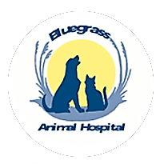
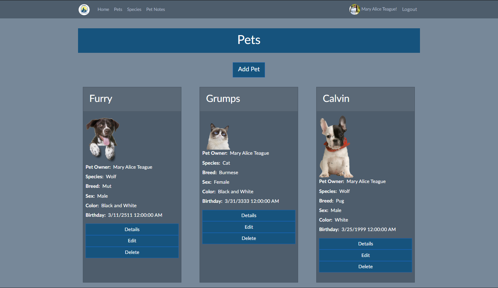

# Back-End-Capstone || PetCare

PetCare is a ASP.Net Core / Entity Framework web application built for Animal Hospital in Farragut, Tennessee. PetCare has full CRUD functionality that allows Pet Owners and Veterinarians to add pets being treated and track pet care along while eliminating any oversight that can arise from the day to day hustle.  

Pet Owners have the ability to add pets and add notes for their pets for their own reference or Veterinarian reference.  Pets and Notes can be edited and deleted. Owners have the ability to add the Veterinarian that takes care of their pets to their Pets.

Veterinarians have the ability to add pets and add notes for Owners pets for their own reference or Veterinarian reference.  Pets and Notes can be edited and deleted. Veterinarians have special permissions when it comes to edit/delete of notes/pets.
#  PetCare


 

# Installation

In your terminal run 


```bash
git clone SSH KEY HERE
```

Open Visual Studio

To run migrations go under the tools tab, open the NuGet Package Manager console and run
```bash
Update-Database 
```

Build and run the application after migrations are complete

# Usage
1. Register a new user
2. Navigate to the Pets link on the navbar/home page
3. Add a your Pets to the pets list.
4. Click on an pets name to view details and view notes.
5. Click on the "Edit" button to edit a pets information.
6. Click on the "Notes" nav bar Link.
7. Add a Note about your pet.
8. Click on "Details" on your note created.
9. Click on "Notes" to view all notes related to your pets.
10. Click delete to get rid of note you created.
11. Click "Home" in the nav bar to return to home page.
