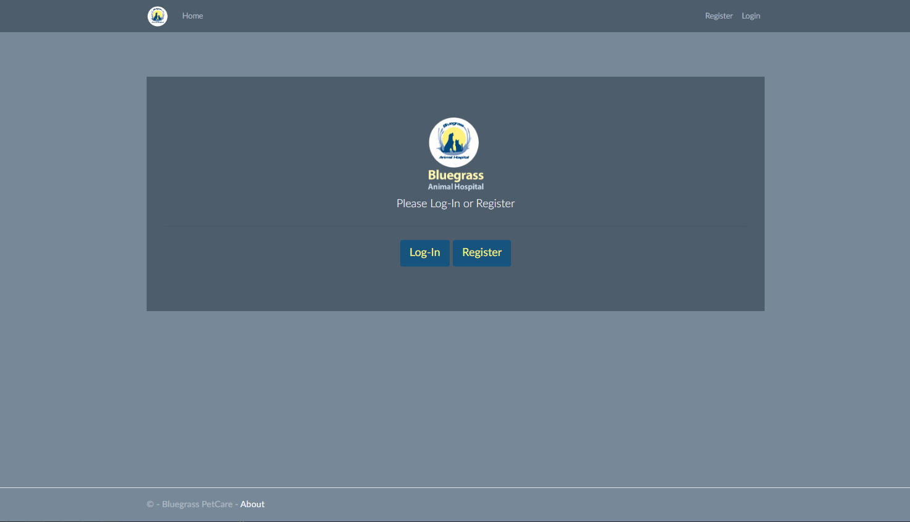

# Bluegrass PetCare

_________________________________________________

Bluegrass PetCare is a ASP.Net Core web application built for Bluegrass Animal Hospital in Farragut, Tennessee. PetCare has full CRUD functionality that allows Pet Owners and Vetrinarians to add pets being treated and track pet care along while eliminating any oversight that can arise from the day to day hustle.  

Pet Owners have the ability to add pets and add notes for their pets for their own reference or Vetrinarian reference.  Pets and Notes can be edited and deleted. Owners have the ability to add the Vetrinarian that takes care of their pets to their Pets.

Vetrinarians have the ability to add pets and add notes for Owners pets for their own reference or Vetrinarian reference.  Pets and Notes can be edited and deleted. Vetrinarians have special permissions when it comes to edit/delete of notes/pets.
#  Bluegrass PetCare


 

# Installation

In your terminal run 


```bash
git clone SSH KEY HERE
```

Open Visual Studio

To run migrations go under the tools tab, open the NuGet Package Manager console and run
```bash
Update-Database 
```

Build and run the application after migrations are complete

# Usage
1. Register a new user
2. Navigate to the Pets link on the navbar/home page
3. Add a your Pets to the pets list.
4. Click on an item's name to view details and edit item
5. Click on the "Find Recipes" icon of an item to view recipes
6. Adjust the item quantity of at least one item to 0 using the "-" icon
7. Navigate to the Grocery List link
Click on the Suggested Items button to view items from pantry that hit the low threshold alert or a quantity of 0
Choose to add an item to your grocery list
Navigate back to Grocery List and add an item that does not already exist in your pantry
Adjust quantity of an item on the grocery list
Click the "Got It" icon
Navigate back to 